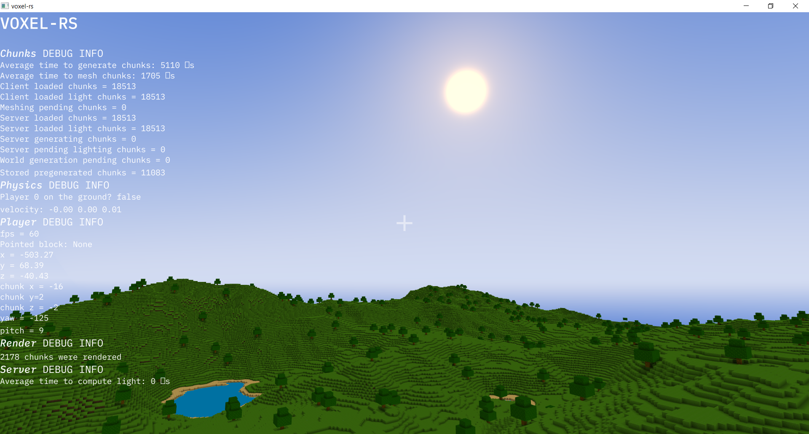

# Voxel-rs
Voxel-rs is a multiplayer Minecraft-like game engine written in Rust.
The game is currently under heavy development and it's not yet playable.
We are still looking for a better name...

## Roadmap
- [x] Voxel world rendering
- [x] Procedural world generation
- [x] Client-server architecture
- [x] Networked physics
- [x] Player physics
- [x] Procedural generation blueprints
- [x] Frustum culling for chunks
- [x] Ambient occlusion using textures
- [x] Lighting
- [x] Block placing and breaking
- [ ] Entities and player mesh (@Azercoco)
- [ ] Items and inventories (@Technici4n)
- [ ] Tile entities and metadata (@Technici4n)
- [ ] Crafting (@Technici4n)
- [ ] Player health (@Technici4n)
- [ ] Clean custom GUI (@Technici4n)
- [ ] Custom key mapping (@Technici4n)
- [ ] Smooth Lightning (@Azercoco)
- [ ] Biomes (@Azercoco)
- [ ] Ambient color in shaders (@Azercoco)
- [ ] Day/night cycle (@Azercoco)
- [ ] Fog (@Azercoco)
- [ ] Fix aliasing issues
- [ ] Fix window issues
- [ ] Fluid support
- [ ] Custom network protocol on top of UDP (@Technici4n)
- [ ] Client and server integration on singleplayer
- [ ] WebAssembly modding support
- [ ] Choose another name for the game

## Screenshots
Current state:

## Running
A standard `cargo run --release` should be enough to run this project.
You may want to enable logging with the environment variable `RUST_LOG=warn,voxel_rs_client=debug,voxel_rs_common=debug,voxel_rs_server=debug`.

## License
The code is licensed under the [MIT license](LICENSE), copyright Azercoco and Technici4n.
The textures are released under the [CC-BY 4.0 license](TEXTURES_LICENSE), copyright Azercoco and Technici4n.