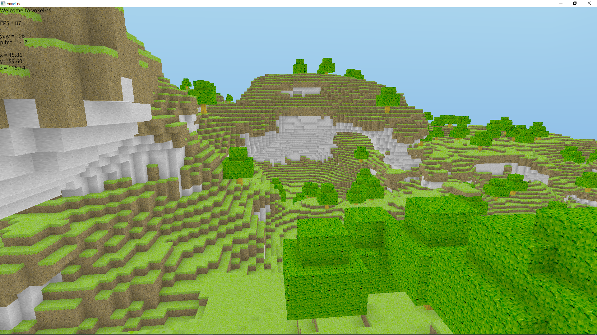

# Voxel-rs
Voxel-rs is a multiplayer Minecraft-like game engine written in Rust.
The game is currently under heavy development and it's not yet playable.
We are still looking for a better name...

## Roadmap
- [x] Voxel world rendering
- [x] Procedural world generation
- [x] Client-server architecture
- [x] Networked physics
- [x] Player physics
- [ ] Procedural generation blueprints (@Azercoco)
- [ ] Frustum culling for chunks (@Azercoco)
- [ ] Geometry shaders to improve rendering performance (@Azercoco)
- [ ] Ambient occlusion using textures
- [ ] Lighting (@Azercoco)
- [ ] Entities and player mesh (@Azercoco)
- [ ] Block placing and breaking (@Azercoco)
- [ ] Custom network protocol on top of UDP (@Technici4n)
- [ ] Clean custom GUI (@Technici4n)
- [ ] Custom key mapping (@Technici4n)
- [ ] Biomes (@Azercoco)
- [ ] Ambient color in shaders (@Azercoco)
- [ ] Day/night cycle (@Azercoco)
- [ ] Fog (@Azercoco)
- [ ] Fix aliasing issues
- [ ] Items and inventories
- [ ] Tile entities and metadata
- [ ] Crafting
- [ ] Player health
- [ ] Fluid support
- [ ] Client and server integration on singleplayer
- [ ] WebAssembly modding support
- [ ] Choose another name for the game

## Screenshots
Current state:
